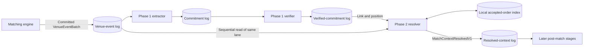
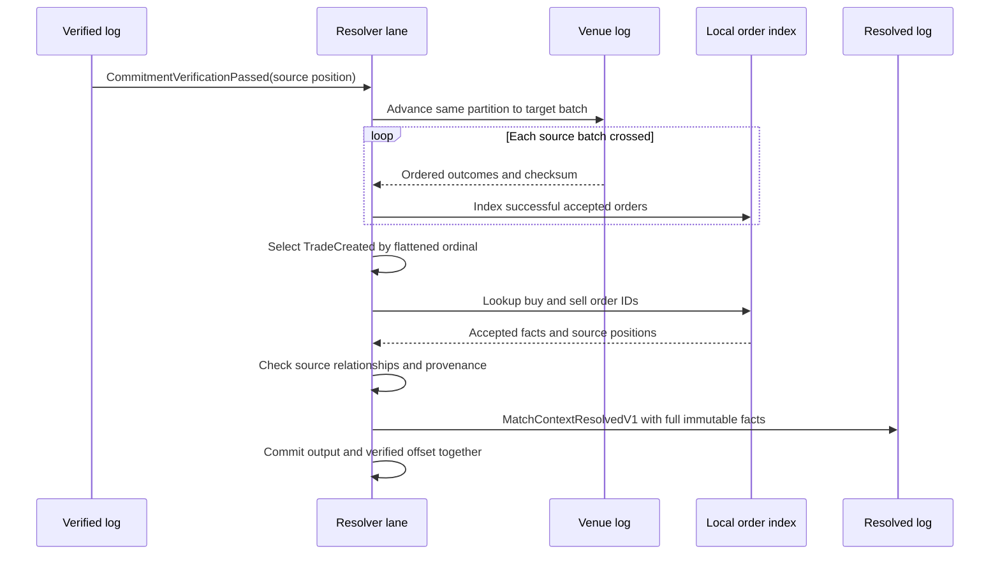
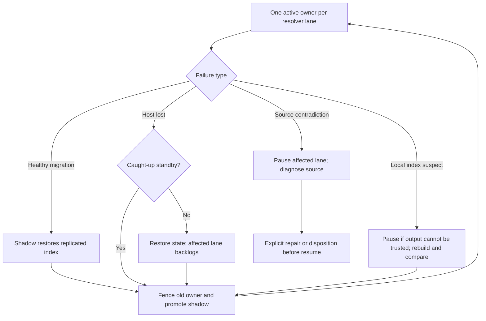

# Calcify Phase 2 — resolved match context

Status: design baseline agreed for incremental implementation; D-042 matching alignment and resolver proofs pending. No Phase 2 throughput claim.
Recorded: 2026-09-29 America/Toronto.
Branch: `codex/calcify-phase2-planning`.

## Purpose and boundary

Phase 2 starts with a `CommitmentVerificationPassed` link from the Phase 1 verified commitment stream. Its first useful result is a resolved match context: the exact `TradeCreated` source fact connected to both accepted order facts and their participant/account identities. This is fact resolution, not trade approval, allocation, clearing, balance checking, or settlement. The Phase 1 PostgreSQL receipt worker remains a temporary diagnostic endpoint; Phase 2 consumes the verified stream directly.

**Research gate:** [source-lane review](../research/CALCIFY_PHASE2_SOURCE_LANE_RESEARCH_2026-09-29.md) found present intake routing includes run ID while matching book scope does not. A cross-run trade can reference an order accepted on another source partition. [D-042](../DECISIONS.md#d-042-shard-local-in-memory-hot-book) already requires run-scoped book ownership aligned with routing; user reaffirmed this direction on 2026-09-29. The one-lane diagram below remains conditional on implementing and proving that existing decision.

**Architecture research:** [Phase 2 architecture review](../research/CALCIFY_PHASE2_ARCHITECTURE_REVIEW_2026-09-29.md) compares primary FIX/DTCC and Apache Kafka/Flink guidance with Reef contracts. The agreed logical flow is verified-led and sequential; the state runtime remains an implementation proof choice between managed recovery facilities and custom coordination.

Matching and accepted-order facts remain authoritative in the venue-event log. Phase 2 assembles them into a durable, self-contained post-match context record; that resolved record is authoritative for what post-match consumers received and can use without rereading source for routine processing. V1 includes the complete immutable `TradeCreated` fact and both complete `AcceptedOrderFact` facts, successful acceptance event identities, command/source provenance, and exact source links. It is not authority for later allocation, clearing, ledger, or settlement outcomes. The local lookup index remains rebuildable state. Do not copy unrelated batch outcomes, mutable order state, or future domain facts.

## Accepted matching prerequisite

- Match scope and routing key are `(runId, venueSessionId, instrumentId)`. Orders from different runs do not trade in one book. Matching book ownership, command lane, venue-event partition, and resolver lane must agree for that scope.
- One active owner orders each book's commands. Physical lane assignment remains stable until an explicit, durable routing epoch and drain/fencing/snapshot/replay handoff; changing partition count must not silently remap an active book. D-042 already defers live migration until those controls exist.
- Current Go matching book key omits run ID despite D-042. Correct this upstream with focused matching, source-partition, and replay fixtures before Phase 2 depends on a local-only order index. A Phase 2 cross-partition lookup is not the fix for this invariant.
- This prerequisite is a narrow matching-boundary alignment, not Phase 2 settlement or a mandate to build live migration now.

## End-to-end flow

Phase 1's temporary PostgreSQL receipt worker also consumes the verified log for diagnostic receipts; it is not Phase 2 input or settlement authority. Matching/venue batches remain upstream fact authority. `MatchContextResolvedV1` is authority for the assembled post-match context delivered to later stages, with source links for audit and rebuild.

### One verified commitment

The diagram shows logical order, not a selected transaction API. State updates, source cursor, output, and verified offset must recover consistently. Kafka orders records within each topic partition, not across source and verified topics; source positions in links bridge the two logs.

1. Own one source partition and its corresponding verified-commitment partition as one logical lane. Advance a source cursor toward each verified link's `(sourceGeneration, sourcePartition, sourceOffset, tradeOrdinal)`; decode each source batch once and retain complete immutable accepted-order facts plus provenance in the local index as they appear.
2. At target batch, select exact `TradeCreated` by flattened ordinal. Reuse decoded batch for subsequent verified links to that batch. Resolve buy and sell order IDs through two local key lookups.
3. Check source relationships only: exact trade position, two genuinely accepted orders, buy/sell sides, same run/session/instrument/lane, accepted-before-trade source order, and generation/provenance. No balance, allocation, clearing, ledger, or settlement check.
4. Publish an idempotently identified assembled result with complete immutable trade and accepted-order facts plus durable links for later stages and audit. Exact envelope layout, encoding, topic, and atomic checkpoint protocol remain design decisions.

The intended normal path has **no per-match PostgreSQL read, full-prefix scan, or random broker seek**. A source batch is read sequentially once per lane, and each trade needs two local order-ID lookups. Source recovery may require a seek, but repeated seeks per trade are outside this design.

## V1 assembled record

`MatchContextResolvedV1` includes:

- Commitment ID `(sourceGeneration, sourcePartition, sourceOffset, tradeOrdinal)` and Phase 1 verification policy version. Current policy is a structural stub; V1 does not present it as economic or settlement approval.
- Complete immutable `TradeCreated`: event/trade/execution IDs, buy/sell order IDs, instrument, quantity, price, currency, occurrence time.
- Both complete immutable `AcceptedOrderFact` records: order/engine/client IDs, run/session/instrument, participant/account, side, original order type/quantity/limit/currency/time-in-force, acceptance time. Include each successful `OrderAccepted` event ID and outcome command ID where present.
- Exact source links for trade and both order facts. Trade link is the commitment position; each accepted-order link adds its batch position and outcome ordinal. Keep registered source generation identity and batch provenance sufficient to detect a recreated or conflicting source.

V1 is one durable assembled fact with a deterministic identity, not a copied venue batch or a mutable order snapshot. Later correction/replacement, if needed, creates a new linked fact. V2 may add stable source/reference lineage within this same meaning; new allocation, clearing, ledger, and settlement outcomes get separate contracts. Exact wire encoding and topic name are implementation details to fix with the contract and tests.

## Lookup state direction

- The order-ID index is a **rebuildable projection**, not a second accepted-order authority. Each value must retain the complete immutable `AcceptedOrderFact`, its successful `OrderAccepted` event ID and outcome command ID, and its exact source position/batch provenance. A resting order may fill many batches later; a source link plus ownership fields cannot assemble the agreed complete V1 without a normal-path backward broker seek. Encode this local row compactly without copying unrelated batch outcomes or mutable order state. Exact key encoding and bytes/order are implementation measurements, not permission to omit fields needed by V1.
- Use partition-local, disk-backed key-value state with a bounded memory cache; do not depend on an unbounded JVM map or remote SQL reads at target rate. Choose the concrete state-store library and changelog/snapshot protocol only after defining replay and failure semantics.
- Keep an order entry while it may match again, including partial fills. Define terminal-state and verified-frontier conditions before eviction; deleting after its first trade is incorrect.
- Index only a successful `SubmitOrder` outcome (`status=accepted` and `result.accepted` present). Current matching code can populate `result.acceptedOrder` from command fields even when submission was rejected; that field's presence alone does not prove acceptance. If accepted-order facts are not available in source order on the same lane before a referencing trade, this flow needs a routing or source-contract change. Verify that precondition against contracts and fixtures before choosing the store.

## Agreed behavior and engineering proofs

| Area | Behavior and proof |
| --- | --- |
| Two-log order | Source position controls the join; duplicates with the same identity/facts are replay no-ops. Future verifier rejection may create gaps among passing links, so a gap alone is not corruption. Prove ordering across batch fanout and restarts. |
| Source coverage | Implement D-042 and prove both accepted orders for every valid trade are recoverable from its lane, including resting orders and partial fills. Require registered source generation identity. |
| Catch-up and conflict | Wait while source reader is behind target. If index misses an order, rebuild/check against source before declaring an integrity fault. Confirmed absent/corrupt/conflicting source pauses affected partition and starts diagnostic recovery; do not fabricate context or silently skip. Other partitions continue. |
| Checkpoint and ownership | One fenced active publisher per lane. Prove complete local order-fact state/source cursor, verified progress, and output across crashes, rebalances, node loss, and shadow restoration. A shadow emits no normal output before promotion. Choose managed state/standby facilities where they fit; avoid an unproved custom recovery control plane. |
| State lifetime | Keep accepted-order entries through run activity, including partial fills. Shared topics use conservative retention to meet run-scoped availability; optional archive is not required. Delay deletion until explicit run-close and completed-link/frontier proof. |
| Output | Emit one deterministic, versioned assembled record with complete immutable source facts and links. Conflicting output for one commitment identity is an integrity fault; later domain status is outside V1. |
| Capacity | Prove near 10k resolved verified commitments/s sustained, plus hot-lane rate, lag, aged state, bytes, restart time, and catch-up headroom on a stated deployment/workload. |

### Recovery and isolation

Shadow workers may prepare state or inspect old source, but never publish an older part of the same lane while active owner publishes later links. Pausing Calcify consumption does not stop matching or Phase 1 producers; backlog remains in the durable logs within their availability window. Other partitions continue.

## Delivery sequence — small, independently checked slices

1. **Matching alignment and source/ordering fixture.** Enforce D-042's run-scoped book/lane key. Prove cross-run same-session non-match, accepted-order and trade facts, flattened ordinals, partition relationship, and repeated references to one batch. Include resting order accepted in an earlier batch, partial fill, malformed and missing source, duplicate verified link, and restart ordering.
2. **Resolver core.** Sequential source cursor, batch reuse, full immutable accepted-order facts in compact local state, deterministic context resolution. Test an old resting order reused across later batches and partial fills with zero normal backward seeks; no settlement behavior.
3. **Durability boundary.** Durable/rebuildable state and idempotent output/checkpoint. Test crashes at index update, output, and checkpoint boundaries, plus stale ownership and source-generation change. Compare managed state/standby support with verified-led source reading before writing custom coordination.
4. **Measured capacity.** Capture source batches decoded, local lookup latency, encoded full-fact index bytes/order, accepted orders/s, V1 record bytes, changelog/standby replication bytes, cache misses, lag slope, output count/identity parity, CPU, memory, disk I/O, and recovery time. Run hot and spread-lane cohorts, high-fanout batches, aged state, and sustained load. Do not infer Phase 2 capacity from Phase 1 or venue-core results.

Target: **near 10,000 verified commitments resolved per second, sustained**. Preserve incoming command rate separately in every workload report; a one-trade-per-crossing-pair fixture would require about 20,000 submitted order commands/s to create 10,000 trades/s. Current C5 proof covers venue-core commands/s with projections disabled; Phase 1 Calcify's local five-minute diagnostic covers 300 crossing pairs/s on one hot lane. Neither qualifies this Phase 2 resolver. See [throughput ledger](../THROUGHPUT_BASELINES.md) and [Phase 1 implementation evidence in PR #430](https://github.com/dills122/reef/pull/430).

## Evidence and design status

Apache Kafka documents local stream-table joins as a way to avoid a remote database request per record, and disk-backed local state with compacted changelog recovery. These are architectural precedents, not a decision to adopt Kafka Streams: [joins](https://kafka.apache.org/43/streams/developer-guide/dsl-api/), [state stores](https://kafka.apache.org/43/streams/developer-guide/processor-api/). LMAX describes in-memory, single-writer exchange processing, but does not document this specific post-match join: [Disruptor paper](https://github.com/LMAX-Exchange/disruptor/blob/master/src/docs/asciidoc/en/disruptor.adoc).

Agreed performance direction: sequential source consumption and local order lookups, with no SQL reads in normal per-trade path. Strict partition locality depends on implementing and proving D-042's matching scope. Design is sufficient for incremental implementation; state runtime and exact wire encoding are engineering choices subject to the focused proofs above. No Phase 2 benchmark has been run.

## Implementation start and callouts

- **Prerequisite:** align Go matcher book key and ownership with D-042, then prove same-lane order coverage and deterministic replay. No cross-partition Phase 2 lookup workaround.
- **State runtime:** the logical verified-led flow is agreed; test whether managed state/standby can support it cleanly. If not, compare the managed two-input topology's pending-state cost with custom recovery cost. This is an implementation proof, not an unbounded redesign discussion.
- **Failure isolation:** infrastructure/state failures may use shadow restoration and fenced promotion. A contradictory upstream fact is not repaired by worker replacement; affected partition waits for explicit diagnosis/disposition.
- **Availability:** no premature order-index eviction or source retention reduction. Full source-prefix replay remains a disaster fallback; measured normal recovery needs a replicated state recovery point before a 10k/s claim.

Initial source check: current direct matching builds each `VenueEventBatch` from ordered command outcomes; `SubmitOrder` attaches `AcceptedOrderFact` to its result, and a trade carries buy/sell order IDs but no participant/account IDs. The acceptance guard above is required. Intake hashes `runId|venueSessionId|instrumentId` to choose a command partition, so same-context submissions route together. We still need to prove both trade sides always share that context, venue-event partition follows it, and verified links preserve source order under replay. See [`processor.go`](../../services/matching-engine/internal/streamdirect/processor.go), [`order.go`](../../services/matching-engine/internal/domain/order.go), [`StreamCommandContracts.kt`](../../services/platform-runtime/src/main/kotlin/com/reef/platform/api/StreamCommandContracts.kt), and [Phase 1 contracts in PR #430](https://github.com/dills122/reef/pull/430).
